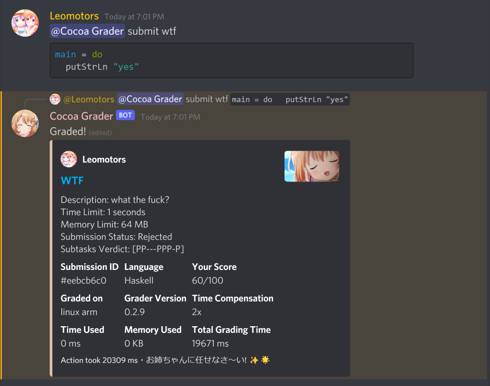
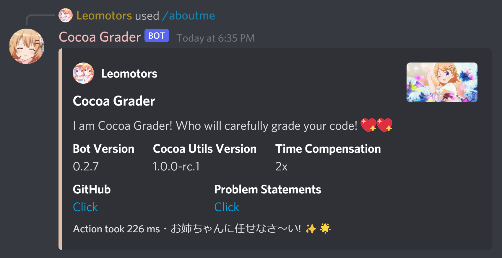

# Cocoa Grader

A Discord Bot Grader, more specifically, '*Waifu Discord Bot*'

~~Created to compete with [Cafe Grader](https://github.com/cafe-grader-team/cafe-grader-web)~~

## 🌲 Dependencies

### To Start the Bot

- nodejs (16.9+, discord.js requirement) with npm and yarn

### To make sure no error occurred

- gcc, python3, ghc

- **pshved/timeout** installed to bin, [see here](https://unix.stackexchange.com/a/44988)

- Use some powerful devices (don't use Raspberry Pi that I use 😖)

## 🍫 Behind this Bot

This Discord Bot use [Cocoa Discord Utils](https://github.com/Leomotors/cocoa-discord-utils),
a library written by me for me to simplify things!

The problems are served by [stupid-problems](https://github.com/Leomotors/stupid-problems)

## 🏷️ Features

- Functional Grader with Time and Memory Limit (but does not prevent `sudo reboot`, use with caution)

- Beautiful Embed (Embed Supremacy)

### Planned

- Interactive (Library like IOI & IPST Camp)

## 🔧 Adding a problem

Create a folder with problem ID as the name of it

Inside that folder, you should have manifest.json

For schema of manifest.json please look [here](./src/grader/problems.ts) or
at src/problems of [stupid-problems](https://github.com/Leomotors/stupid-problems)

## 🖼️ Gallery of Cocoa Grader

*All pictures are at Version 0.2.7 except for submit is at 0.2.9*

| Pictures ||
| --- | --- |
|  |  |
|  |  |
